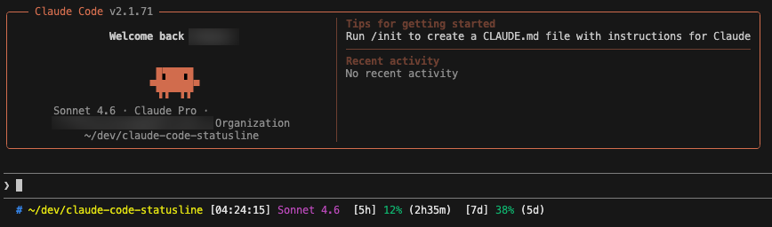

# ClaudeCodeStatusline

Claude Code のステータスライン用スクリプトです。



## スクリプト

### `statusline-command.sh`

Claude Code の [statusLine](https://docs.anthropic.com/ja/docs/claude-code/settings) に設定するコマンドです。

以下の情報をターミナルのステータスバーに表示します:

- **作業ディレクトリ** と **Git ブランチ**
- **現在時刻**
- **使用中のモデル名**
- **コンテキスト使用率** (緑 / 黄 / 赤でカラー表示)
- **API 使用率**: 5 時間枠・7 日枠の utilization % とリセットまでの残り時間

API 使用率は macOS キーチェーンから Claude Code の OAuth トークンを取得して Anthropic API から取得します。360 秒間キャッシュします (`/tmp/claude-usage-cache.json`)。

## セットアップ

### 自動インストール (推奨)

```sh
curl -fsSL https://raw.githubusercontent.com/HappyOnigiri/ClaudeCodeStatusline/main/setup.sh | bash
```

`~/.claude/statusline-command.sh` のダウンロードと `~/.claude/settings.json` への設定追加を自動で行います。変更前に差分を表示して確認を求めます。

### 手動インストール

1. スクリプトを `~/.claude/` にコピーして実行権限を付与する:

```sh
cp statusline-command.sh ~/.claude/
chmod +x ~/.claude/statusline-command.sh
```

2. `~/.claude/settings.json` に以下を追加する:

```json
{
  "statusLine": {
    "type": "command",
    "command": "bash ~/.claude/statusline-command.sh"
  }
}
```

## 依存関係

- `bash`
- `jq`
- `python3`
- `curl`
- `security` (macOS キーチェーンアクセス用)
